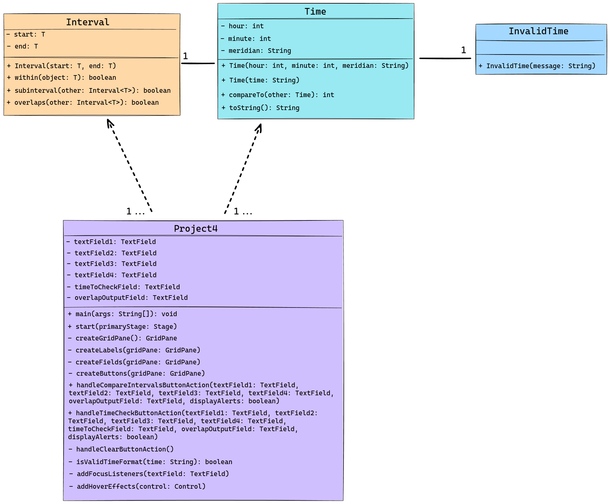

<!-- Title -->
<h1 align="center">Time Interval Checker</h1>
<p align="center">


<i>This project 
</i></p>

---

<h2 align="center">Tech Used 🧰</h2>

<!-- Tech Stack -->
<p align="center">
<kbd>
<a href="https://www.java.com/en/">
    
  </a> | <a href="https://makefiletutorial.com/">
    
  </a> | <a href="https://git-scm.com/">
    
  </a>
  
  </kbd>
</p>

## User Guide 📔

This guide provides instructions on how to set up and run the project using two different methods: Cloning the repository and downloading the project as a ZIP file.

### Prerequisites

Before you begin, ensure you have the following installed:
- Java JDK
- [JavaJX](https://openjdk.org/) (Note: JavaFX is required to run the project. Download and install it before proceeding. Place the JavaFX .jar files in a `lib` directory at the root of the project.)
- Git (for cloning the repository)

### File Structure

<details>
<summary><b>See File Tree</b></summary>

The suggested file structure for your project is as follows:

```

.
└── time_interval_checker/
    ├── .vscode/
    │   ├── launch.json
    │   └── settings.json
    ├── bin/
    │   ├── main class files
    │   ├── test class files
    │   └── time.json
    ├── lib/
    │   └── javafx.jar files
    ├── public/
    │   └── image files
    ├── src/
    │   ├── main/
    │   │   ├── Controller.java
    │   │   ├── Interval.java
    │   │   ├── InvalidTime.java
    │   │   ├── main.fxml
    │   │   ├── Project4.java
    │   │   └── Time.java
    │   └── test/
    │       ├── GenerateTimeData.java
    │       ├── IntervalTest.java
    │       ├── InvalidTimeTest.java
    │       ├── Project4Test.java
    │       ├── TestRunner.java
    │       └── TimeTest.java
    ├── Makefile
    ├── .gitignore
    └── README.md

```

</details>

### Setup launch.json

Every file that requires usage of the JavaFX modules, needs “vmArgs” in its configuration.

<details>
<summary><b>See launch.json Example</b></summary>

```

{
  "version": "0.2.0",
  "configurations": [
    {
        "type": "java",
        "name": "TimeTest",
        "request": "launch",
        "mainClass": "test.TimeTest",
        "projectName": "time_interval_checker_17fce51b"
      },
      {
        "type": "java",
        "name": "TestRunner",
        "request": "launch",
        "mainClass": "test.TestRunner",
        "projectName": "time_interval_checker_17fce51b",
        "vmArgs": "--module-path /home/slozier/Desktop/javafx-sdk-21.0.2/lib --add-modules javafx.controls,javafx.fxml"
      }
  ]
}

```

</details>

### Option 1️⃣ : Cloning the Repository

1. **Clone the Repository**

   Open your terminal and run the following command to clone the repository: **`git clone git@github.com:sllozier/time_interval_checker.git`**


2. **Navigate to the Project Directory**

    Once the repository is cloned, navigate to the project directory: **`cd path/to/time_interval_checker`**

3. **Using the Makefile**

    - To generate text files, compile the project, run tests, and then run the project code (if tests pass), use: **`make all`**

    - To only generate the text files, use: **`make generate_json_file`**

    - To run tests (this will also generate text files), use:**`make run_tests`**

    - To run the project code (this will also generate text files), use:**`make run_project`**

    - To clean up and remove generated files, use: **`make clean`**


### Option 2️⃣ : Downloading the ZIP File

1. **Download the Project**

    Go to the repository page on GitHub (or relevant hosting service), and click on the **`Download ZIP`** button. Save the ZIP file to your desired location and extract it.

2. **Navigate to the Project Directory**

    Open your terminal and navigate to the extracted project directory: **`cd path/to/extracted/time_interval_checker`**

3. **Using the Makefile**

    Follow the same steps as in **Option 1** for using the Makefile.

---

*Remember to replace **`[repository URL]`** and **`path/to/time_interval_checker`** with the actual URL of your repository and the path to the **`time_interval_checker`** directory in your local system. This guide assumes that the Makefile is located in the **`time_interval_checker`** directory and is set up as previously discussed.*

---

## Approach


## Assumptions


## Lessons Learned

Throughout the development process, several key insights were gained:


## Possible Improvements

To further enhance the project, the following areas can be addressed:


---

### UML Diagram

<details>
<summary><b>See Diagram</b></summary>

</details>

---


<h2 align="center">Contact Me 🦄</h2>
<!-- Contact Me -->
<p align="center">
<kbd>
<a href="mailto:sarah.lozier@gmail.com">
    
  </a> | <a href="https://www.sllozier.com">
    
  </a> | <a href="https://www.linkedin.com/in/sarah-l-lozier/">
    
  </a> | <a href="https://github.com/sllozier/resume/raw/main/sarah_lozier_resume%20.pdf">
    
  </a>
  </kbd>
</p>


