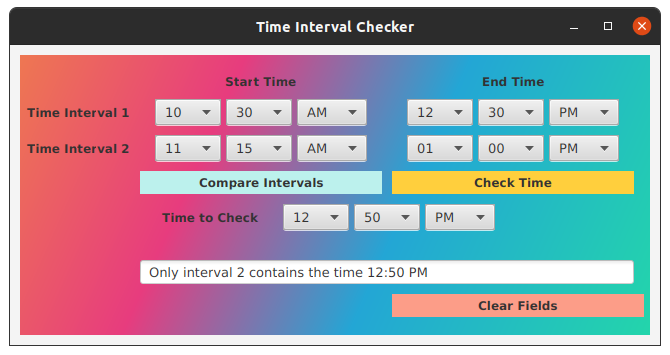

<!-- Title -->
<h1 align="center">Time Interval Checker</h1>
<p align="center">


<i>The Time Interval Checker project is a Java application designed to facilitate the comparison and analysis of time intervals. It provides users with a convenient interface to input two time intervals and determine their relationship, including whether they overlap, one is a subinterval of the other, or if they are disjoint. The application also allows users to check if a specific time falls within the defined intervals. Key features include a user-friendly graphical interface built with JavaFX, input validation for ensuring correct time formats, and clear output messages indicating the relationship between the intervals or the presence of a specified time within them. The project leverages object-oriented principles, utilizing classes such as `Time` and `Interval` to represent time instances and intervals, respectively, while the `Project4` class serves as the main application driver. Overall, the Time Interval Checker project offers a practical solution for analyzing time intervals and aiding in time-related decision-making processes. 
</i></p>

---

<h2 align="center">Tech Used 🧰</h2>

<!-- Tech Stack -->
<p align="center">
<kbd>
<a href="https://www.java.com/en/">
    
  </a> | <a href="https://makefiletutorial.com/">
    
  </a> | <a href="https://git-scm.com/">
    
  </a>
  
  </kbd>
</p>

## User Guide 📔

This guide provides instructions on how to set up and run the project using two different methods: Cloning the repository and downloading the project as a ZIP file.

### Prerequisites

Before you begin, ensure you have the following installed:
- Java JDK
- [JavaJX](https://openjdk.org/) (Note: JavaFX is required to run the project. Download and install it before proceeding. Place the JavaFX .jar files in a `lib` directory at the root of the project.)
- Git (for cloning the repository)

### File Structure

<details>
<summary><b>See File Tree</b></summary>

The suggested file structure for your project is as follows:

```

.
└── time_interval_checker/
    ├── .vscode/
    │   ├── launch.json
    │   └── settings.json
    ├── bin/
    │   ├── main class files
    │   ├── test class files
    │   └── time.json
    ├── lib/
    │   └── javafx.jar files
    ├── public/
    │   └── image files
    ├── src/
    │   ├── main/
    │   │   ├── Controller.java
    │   │   ├── Interval.java
    │   │   ├── InvalidTime.java
    │   │   ├── main.fxml
    │   │   ├── Project4.java
    │   │   └── Time.java
    │   └── test/
    │       ├── GenerateTimeData.java
    │       ├── IntervalTest.java
    │       ├── InvalidTimeTest.java
    │       ├── Project4Test.java
    │       ├── TestRunner.java
    │       └── TimeTest.java
    ├── Makefile
    ├── .gitignore
    └── README.md

```

</details>

### Setup launch.json

Every file that requires usage of the JavaFX modules, needs “vmArgs” in its configuration.

<details>
<summary><b>See launch.json Example</b></summary>

```

{
  "version": "0.2.0",
  "configurations": [
    {
        "type": "java",
        "name": "TimeTest",
        "request": "launch",
        "mainClass": "test.TimeTest",
        "projectName": "time_interval_checker_17fce51b"
      },
      {
        "type": "java",
        "name": "TestRunner",
        "request": "launch",
        "mainClass": "test.TestRunner",
        "projectName": "time_interval_checker_17fce51b",
        "vmArgs": "--module-path /home/slozier/Desktop/javafx-sdk-21.0.2/lib --add-modules javafx.controls,javafx.fxml"
      }
  ]
}

```

</details>

### Option 1️⃣ : Cloning the Repository

1. **Clone the Repository**

   Open your terminal and run the following command to clone the repository: **`git clone git@github.com:sllozier/time_interval_checker.git`**


2. **Navigate to the Project Directory**

    Once the repository is cloned, navigate to the project directory: **`cd path/to/time_interval_checker`**

3. **Using the Makefile**

    - To generate text files, compile the project, run tests, and then run the project code (if tests pass), use: **`make all`**

    - To only generate the text files, use: **`make generate_json_file`**

    - To run tests (this will also generate text files), use:**`make run_tests`**

    - To run the project code (this will also generate text files), use:**`make run_project`**

    - To clean up and remove generated files, use: **`make clean`**


### Option 2️⃣ : Downloading the ZIP File

1. **Download the Project**

    Go to the repository page on GitHub (or relevant hosting service), and click on the **`Download ZIP`** button. Save the ZIP file to your desired location and extract it.

2. **Navigate to the Project Directory**

    Open your terminal and navigate to the extracted project directory: **`cd path/to/extracted/time_interval_checker`**

3. **Using the Makefile**

    Follow the same steps as in **Option 1** for using the Makefile.

---

*Remember to replace **`[repository URL]`** and **`path/to/time_interval_checker`** with the actual URL of your repository and the path to the **`time_interval_checker`** directory in your local system. This guide assumes that the Makefile is located in the **`time_interval_checker`** directory and is set up as previously discussed.*

---

## Approach

My approach involved breaking down the problem into smaller tasks, such as designing the UI layout, implementing event handling for user interactions, and integrating necessary data structures for time interval comparison. I started by analyzing the project requirements and designing the UI layout using JavaFX's layout containers. Then, I implemented the logic for comparing time intervals and checking if a given time falls within the intervals. Finally, I thoroughly tested the application to ensure proper functionality and responsiveness. This step-by-step approach allowed for efficient development and ensured a well-structured and user-friendly application within the given timeframe.


## Assumptions

None

## Lessons Learned

Throughout the project development, several key insights were gained. First, tackling time formatting, especially in a 12-hour format while considering meridian evaluation, proved challenging. Despite multiple approaches, resolving edge cases remained elusive, highlighting the intricacies of time-related computations. Second, while conducting tests, discrepancies arose where certain tests failed to appropriately assert exceptions, emphasizing the critical need for rigorous testing to ensure robust error handling. Last, using string inputs uncovered a notable margin for user error, underscoring the importance of implementing more stringent input validation mechanisms to improve user experience and minimize data entry errors. These experiences underscored the significance of meticulous planning, thorough testing, and the continuous pursuit of user-centric design principles in software development endeavors.

## Possible Improvements

Several significant improvements have been implemented to refine the functionality and usability of the application. Initially, addressing the challenge of time reformatting, I decided to convert 12-hour time inputs to 24-hour format internally which has proven effective in handling edge cases more comprehensively. This approach ensures consistency and accuracy in time comparisons, contributing to the overall reliability of the system. Moreover, testing procedures have been enhanced by integrating exception handling directly into relevant methods, resulting in more thorough test coverage and improved accuracy in identifying and handling errors. By embedding exception handling within the core functionality, the testing process becomes more streamlined and effective, facilitating the identification and resolution of potential issues. Another significant improvement involves the development of a secondary user interface option featuring combo boxes for time inputs. This alternative interface reduces the margin for user error by providing predefined values, thereby enhancing the overall usability and user experience. With combo boxes facilitating the intuitive selection of time components, users can input data more accurately and efficiently. A screenshot below showcases the secondary GUI option. These enhancements collectively contribute to a more robust and user-friendly application, aligning with best practices in software development.

<details>
<summary><b>GUI Option 2</b></summary>

</details>
---

### UML Diagram

<details>
<summary><b>See Diagram</b></summary>

</details>

---


<h2 align="center">Contact Me 🦄</h2>
<!-- Contact Me -->
<p align="center">
<kbd>
<a href="mailto:sarah.lozier@gmail.com">
    
  </a> | <a href="https://www.sllozier.com">
    
  </a> | <a href="https://www.linkedin.com/in/sarah-l-lozier/">
    
  </a> | <a href="https://github.com/sllozier/resume/raw/main/sarah_lozier_resume%20.pdf">
    
  </a>
  </kbd>
</p>


